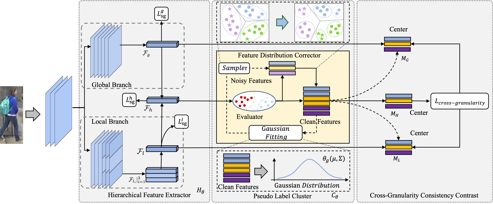

# Distribution-Guided Hierarchical Calibration Contrastive Network for Unsupervised Person Re-Identification

This repository contains the author's implementation in PyTorch for the TCSVT paper "Distribution-Guided Hierarchical Calibration Contrastive Network for Unsupervised Person Re-Identification"

**Our unified framework**


# Requirements
## installation

```shell
pip install -r requirements.txt
```

##Prepare Datasets

```shell
cd examples && mkdir data
```
Download the person datasets Market-1501,MSMT17,PersonX,DukeMTMC-reID and the vehicle datasets VeRi-776 from [aliyun](https://virutalbuy-public.oss-cn-hangzhou.aliyuncs.com/share/data.zip).
Then unzip them under the directory like

```
ClusterContrast/examples/data
├── market1501
│   └── Market-1501-v15.09.15
├── msmt17
│   └── MSMT17_V1
├── personx
│   └── PersonX
├── dukemtmcreid
│   └── DukeMTMC-reID
```

## Training

We utilize 4 GTX-3090 GPUs for training. 

**examples:**

Market-1501:
```shell
CUDA_VISIBLE_DEVICES=0,1,2,3 python examples/dhccn.py -b 256 -a hfe -d market1501 --iters 200 --momentum 0.4 --eps 0.4 --lamb=0.5 --noisy-threshold 0.1 --num-instances 16
```

MSMT17:
```shell
CUDA_VISIBLE_DEVICES=0,1,2,3 python examples/dhccn.py -b 256 -a hfe -d msmt17 --iters 400 --momentum 0.3 --eps 0.7 --lamb 0.7 --noisy-threshold 0.1 --num-instances 16
```

DukeMTMC-reID:

```shell
CUDA_VISIBLE_DEVICES=0,1,2,3 python examples/dhccn.py -b 256 -a resnet50 -d dukemtmcreid --iters 200 --momentum 0.1 --eps 0.6 --lamb 0.5 --noisy-threshold 0.1 --num-instances 16
```
Personx:

```shell
CUDA_VISIBLE_DEVICES=0,1,2,3 python examples/dhccn.py -b 256 -a resnet50 -d personx --iters 200 --momentum 0.1 --eps 0.7 --lamb 0.5 --noisy-threshold 0.1 --num-instances 16
```


## Acknowledgements
The code is based on [CCL](https://github.com/alibaba/cluster-contrast-reid) licensed under MIT.
